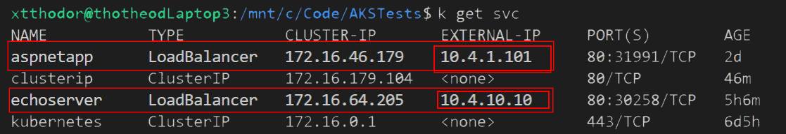

> draft version - review needed

# Introduction
In a Kubernetes cluster we host several applications and we need an easy way to expose them. This can be done easily with [Services](https://kubernetes.io/docs/concepts/services-networking/service/). However when our applications start to increase or when we need more capabilities like configurable traffic routing, reverse proxy etc, then we can use an [Ingress Controller](https://kubernetes.io/docs/concepts/services-networking/ingress/).

There are several ingress controllers that can be used in a Kubernetes cluster (i.e. [nginx](https://kubernetes.github.io/ingress-nginx/deploy/#azure), [Traefik](https://doc.traefik.io/traefik/providers/kubernetes-ingress/) ), but in the case of AKS we have the option to use Azure Application Gateway V2 as an ingress controller (aka [AGIC](https://docs.microsoft.com/en-us/azure/application-gateway/ingress-controller-overview)). There are several benefits of using AGIC, with most profound:
- better performance (because eliminates the need of another Load Balancer and decreases the hops in the communication path) 
- Autoscalling capabilities without consuming resources from the AKS cluster
- Web Application Firewall capabilities when WAF_v2 is enabled

AGIC integration in practice has some drawbacks though. 
- Downtime during deployments can happen (*502 error codes*) which can be minimized if you follow this [How To Guide](https://github.com/Azure/application-gateway-kubernetes-ingress/blob/master/docs/how-tos/minimize-downtime-during-deployments.md#minimizing-downtime-during-deployments).
- Tighter integration with PaaS services may increase the effort to deploy your workloads to other Kubernetes based clusters (other than AKS) 

## Native AKS ingress Controller behind Azure appGW
An alternative to the all or nothing approach (AGIC or just ingress controller) that can combine the advantages of both aforementioned approaches is to have your AKS workloads exposed internally through services or ingress controller (_with internal load balancers, internal IPs_). In front of them, we can place an appGW_v2 to expose the services we want to the public and on top of that we can of course enable WAF_v2 capabilities. 

Both [AKS Baseline Architecture](https://github.com/mspnp/aks-baseline#core-architecture-components) and [AKS Regulated cluster for PCI-DSS 3.2.1](https://github.com/mspnp/aks-baseline-regulated#workload-https-request-flow) reference architectures follow this pattern (and not AGIC). In the first case they use Traefik Ingress Controller while in the second architecture they use nginx. Both of them are internal behind an appGW_v2/WAF_v2. 

# Lab
To showcase the architecture we will spin up 4 different applications
- aspnetapp (mcr.microsoft.com/dotnet/core/samples:aspnetapp)
- echoserver (k8s.gcr.io/echoserver:1.4)
- hello-world-one (mcr.microsoft.com/azuredocs/aks-helloworld:v1)
- hello-world-two (mcr.microsoft.com/azuredocs/aks-helloworld:v1 with different content)

The aim is to have only one public IP (pip), the appGW's pip, with all four apps being exposed only internally, and published in three different FQDNs through the appGW
- aspnetapp.theolabs.gr (aspnetapp)
- echoserver.theolabs.gr (echoserve)
- nginx.theolabs.gr (all routes of nginx controller, like /hello-world-one and /hello-world-two)


## Prerequisites
- AKS Cluster deployed into an existing Virtual Network / subnet ([Kubenet](https://docs.microsoft.com/en-us/azure/aks/configure-kubenet#overview-of-kubenet-networking-with-your-own-subnet) or [CNI(https://docs.microsoft.com/en-us/azure/aks/configure-azure-cni#plan-ip-addressing-for-your-cluster)])
- An extra subnet, or enough space on your Vnet to create a new subnet that will be used from AKS Services
- An appGW_v2

## Network configuration
For the lab's pupropses we have a virtual network called ```vnet-AKS``` with (huge) address space ```10.4.0.0/16```. We have at least two subnets
- ```snet-appGW (10.4.0.0/24)``` for the Application Gateway
- ```snet-aksNodes (10.4.1.0/24)``` for the AKS 

## Spin up aspnetapp
To expose a service external to AKS we need a yaml file like the following:
``` yaml
apiVersion: v1
kind: Service
metadata:
  name: aspnetapp
spec:
  type: LoadBalancer
  selector:
    app: aspnetapp
  ports:
  - protocol: TCP
    port: 80
    targetPort: 80
```
if we deploy such a service, AKS will create a Public IP to expose the Service (using the external Azure Load Balancer). 

#### Create Internal IP
In order to prevent that we can use the following annotation 
``` yaml
service.beta.kubernetes.io/azure-load-balancer-internal: "true"  
```
This annotation will instruct AKS to use (and create if not any yet available) an internal Load Balancer. The service will get an avaialbe Internal IP from the ```snet-aksNodes``` subnet. 

We could use this internal IP as a backend pool in the AppGW to expose it to the public internet. 

#### Pin internal IP of the Service
__But__ what happens if you need to stop the Service and then redeploy it? This would cause an operation overhead. Most possibly the newly created service would get another internal IP, so we should change the Backend Pool IP of the AppGW.
In order to achieve that we can use the following property ``` loadBalancerIP: 10.4.1.101 ```. So the new [aspnetapp.yaml](workloads/aspnetapp.yaml) would be : 
``` yaml 
apiVersion: v1
kind: Pod
metadata:
  name: aspnetapp
  labels:
    app: aspnetapp
spec:
  containers:
  - image: "mcr.microsoft.com/dotnet/core/samples:aspnetapp"
    name: aspnetapp-image
    ports:
    - containerPort: 80
      protocol: TCP
---
apiVersion: v1
kind: Service
metadata:
  name: aspnetapp
  annotations:
    service.beta.kubernetes.io/azure-load-balancer-internal: "true"  
spec:
  type: LoadBalancer
  loadBalancerIP: 10.4.1.101
  selector:
    app: aspnetapp
  ports:
  - protocol: TCP
    port: 80
    targetPort: 80
```

## Spin up echoserver
The solution given for [aspnetapp.yaml](workloads/aspnetapp.yaml) is ok, but can further be improved. The problem is that there could be cases that if we stop the aspnetapp service, and in the meanwhile other activities happen in the cluster (i.e. add a new node in the node pool) the pinned internal IP could potentially be reserved (i.e. foor the new node). To Solve that problem we can use a [seperate network subnet](https://docs.microsoft.com/en-us/azure/aks/internal-lb#specify-a-different-subnet). The subnet specified must be in the same virtual network as your AKS cluster. So we can define a third subnet ```snet-aksAppServices (10.4.10.0/24)``` and use the following annotation, as used in the [echoserver.yaml](workloads/echoserver.yaml):
```yaml
service.beta.kubernetes.io/azure-load-balancer-internal-subnet: "snet-aksAppServices"
```
If we now deploy that yaml file ( ```kubectl apply -f ./workloads/echoserver.yaml ``` )  we can see that the Service takes an Internal IP from the Address Space of the subnet ```snet-aksAppServices```. We can pin that IP without the risk of getting conflicts with other services or nodes that dynamically get an IP from the ```snet-aksNodes``` subnet.



## Create nginx controller

#### Make nginx controller internal

#### Deploy HelloWorld samples with Ingress Routes (on specific namespace)


# Expose through AppGW

## Configure Backend pools

## Configure Listeners

## Bind them all together - Configure Rules
